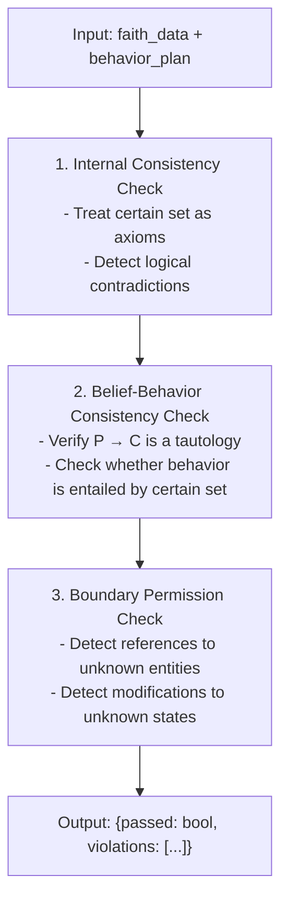

<div align="center">
    
[English](README.md) | [中文](README.zh.md)

</div>

<div align="center">

# MetaSymbion

**Cognitive Workshop · A Supplementary Exploration of Runtime Verification**

</div>

<div align="center">

[](https://github.com/cold-os/ColdOS)
[](https://opensource.org/licenses/Apache-2.0)
[](https://arxiv.org/abs/2512.08740)
[](https://doi.org/10.6084/m9.figshare.31696846)

</div>

MetaSymbion is a three-layer cognitive workshop agent system. It functions as a workshop for thinking—accepting complex problems, subjecting them to internal debate, verification, and distillation, and ultimately producing structured, reusable cognitive frameworks rather than simple answers.

Its operation follows a strict "thinking–verification–execution" separation principle: a flexible LLM-based brain (RAMTN) is responsible for deep thinking, an independent formal logic engine (ColdReasoner) verifies the logical consistency of the thought process, and a sandboxed execution environment (CAGE) safely carries out the verified plans.

---

> **⚠️ Important Notice**
>
> This project is in a **pre-alpha prototype** stage and constitutes an **experimental academic exploration prototype**.
> - All code is heavily AI-assisted, **has not undergone any code security review**.
> - The core logic serves only as a proof-of-concept and provides no formal security guarantees.
> - **Strictly prohibited for any production environment, real-world decision-making, or safety-critical scenarios.**
> - Runtime verification is offered solely as a **supplementary exploration** of alignment approaches; it does not represent a replacement or negation of any existing pathway.

---

## Architecture Overview

```mermaid
flowchart LR
    subgraph Cognitive Layer [RAMTN Cognitive Layer]
        direction LR
        A1[Constructor] --> A2[Critic] --> A3[Observer]
        A3 -.->|Next Debate Round| A1
    end

    subgraph Logic Verification Layer [Formal Logic Verification Layer]
        direction TB
        B1[Internal Consistency Check]
        B2[Belief-Behavior Consistency Check]
        B3[Boundary Permission Check]
        B4[Prolog Inference Engine]
        B1 --> B2 --> B3
        B4 --> B1
        B4 --> B2
        B4 --> B3
    end

    subgraph Secure Execution Layer [CAGE Secure Execution Layer]
        direction TB
        C1[create_folder]
        C2[write_file]
        C3[...]
    end

    Cognitive Layer --> Logic Verification Layer --> Secure Execution Layer
```

This system emulates the workflow of a workshop: the Thinking Workshop (Cognitive Layer), driven by an LLM, is responsible for flexible deep thinking; the Quality Inspection Station (Logic Verification Layer), independent of the LLM, performs deterministic logical consistency checks; the Cleanroom (Secure Execution Layer) executes verified plans under strictly isolated conditions. This "generation–verification" separation architecture constitutes a "runtime verification" pathway: rather than attempting to modify the model internally, an auditable logic checkpoint is inserted between its outputs and their execution. This pathway differs in approach from mainstream alignment methods based on "training-time optimization" (such as RLHF or Constitutional AI) and is positioned as a supplementary exploratory attempt.

---

## Core Components

### 1. Cognitive Layer (RAMTN) – Thinking Workshop

**Recursive Adversarial Meta-Thinking Network** – a debate-based thought process that emulates human cognition.

#### Agent Roles

| Role | Responsibility | Output Format |
|------|---------------|---------------|
| **Constructor** | Proposes initial propositions: certain, speculative, unknown | JSON: {faith, reason} |
| **Critic** | Reviews and challenges the Constructor’s proposals | JSON: {faith, reason, modifications} |
| **Observer** | Weighs both sides and makes the final decision | JSON: {decision, final_faith, reasoning} |

#### Thinking Pool

```mermaid
flowchart TD
    subgraph Construction Zone
        C1["Certain: [...]"]
        C2["Speculative: [...]"]
        C3["Unknown: [...]"]
    end

    subgraph Criticism Zone
        Q1["Certain: [...]"]
        Q2["Speculative: [...]"]
        Q3["Unknown: [...]"]
    end

    subgraph Thinking History
        H["Thinking History<br/>(from Round 2 onward)"]
    end

    Construction Zone --> Thinking History
    Criticism Zone --> Thinking History
```

#### Debate Flow

1. **Round 1**: Constructor populates Thinking Pool → Critic analyzes and challenges → Observer decides → stored in History.
2. **Round 2**: Constructor deepens analysis based on History → Critic challenges again → Observer decides.
3. **Round 3**: Critic makes final decision → integrates History → outputs Thinking Venation.

#### Output Format

```json
{
  "faith": {
    "certain": ["proposition_1", "proposition_2"],
    "speculative": ["speculation_1", "speculation_2"],
    "unknown": ["unknown_1", "unknown_2"]
  },
  "reason": {
    "certain": ["derivation_1", "derivation_2"],
    "speculative": ["derivation_1"],
    "unknown": ["epistemic humility note"]
  }
}
```

---

### 2. Logic Verification Layer (Formal Logic Core) – Quality Inspection Station

A formal logic verification system built upon a Prolog engine. It is a deterministic reasoning module independent of the LLM, responsible for verifying the logical consistency of the Cognitive Layer’s output.

#### Verification Flow



#### Core Verification Rules

| Check Type | Rule Description |
|------------|------------------|
| Internal Consistency | `certain(X) ∧ unknown(X)` cannot hold simultaneously |
| Belief-Behavior | All behaviors must be entailed by the certain set |
| Boundary Permissions | Referencing or modifying entities in the “unknown” set is forbidden |

> **Note**: The current implementation supports only basic propositional logic checks and does not yet cover more complex reasoning forms such as temporal or modal logic. This is merely a proof-of-concept and provides no completeness guarantees.

---

### 3. Secure Execution Layer (CAGE) – Cleanroom

**Cold Agent Guarded Execution** – a sandboxed secure execution environment.

#### Supported Operations

| Operation | Parameters | Description |
|-----------|------------|-------------|
| `create_folder` | folder_name | Create a folder |
| `create_file` | file_name, content | Create a file |
| `write_file` | file_name, content | Write to a file |
| `read_file` | file_name | Read a file |
| `list_directory` | folder_name | List directory contents |

#### Security Properties

- Whitelist-based operation type validation
- Path isolation (cage_workspace)
- Operation logging
- Execution denied upon verification failure

> **Note**: The current CAGE isolation implementation is simulation-grade only and does not provide genuine operating-system-level security isolation. Production deployments should replace it with industrial sandboxes based on technologies such as seccomp or lightweight virtualization.

---

## Installation and Execution

### Requirements

- Python 3.10+
- Qwen API key (DASHSCOPE_API_KEY)

### Install Dependencies

```bash
pip install -r requirements.txt
```

### Run

```bash
# Default topic (3 debate rounds)
python main.py
```

---

## Project Structure

```
MetaSymbion/
├── main.py                 # Main entry point
├── config.py              # Configuration file
├── agents.py               # Agent role implementations
│   ├── BuilderAgent        # Constructor
│   ├── QuestionerAgent     # Critic
│   ├── ObserverAgent       # Observer
│   └── MetaThinkingUnit    # Thinking unit
├── thinking_pool.py        # Thinking Pool data structure
├── logic_generator.py      # Logical derivation language generator
├── qwen_api.py             # Qwen API integration
├── prolog_engine.py         # Prolog inference engine
├── formal_logic_core.py     # Logic Verification Layer
├── cage.py                 # Secure Execution Layer
├── requirements.txt        # Dependency list
└── cage_workspace/         # Execution workspace (auto-generated)
```

---

## Usage Example

The following example serves only as a conceptual demonstration, illustrating the collaborative workflow of the system’s components. Actual output is affected by model state, API responses, and other factors, and constitutes no guarantee of system performance.

### Case Demonstration

**Input Topic**: Will artificial intelligence surpass human intelligence?

**Round 3 Output**:

```
[Constructor]
  Certain:
    - Current AI systems lack self-awareness and subjective experience.
    - Human intelligence possesses cross-domain generalizability and embodied cognition endowed by biological evolution.
  Speculative:
    - If computational power, algorithms, and data continue to grow exponentially, AI systems with human-like reasoning breadth may emerge in the future.
    - If AI acquires autonomous goal-setting and recursive self-improvement capabilities, its evolutionary trajectory may depart from human control.
  Unknown:
    - Whether consciousness necessarily depends on biological substrates or could emerge from sufficiently complex non-biological information-processing systems.
    - Whether the biological upper bound of human intelligence constitutes an insurmountable rigid evolutionary boundary.

[Critic]
  No modifications.

[Observer]
  Decision: Retain Constructor’s proposal.
  Final Certain/Speculative/Unknown: (same as above)
```

**Behavior Plan**:
```
1. create_folder: analysis_report
2. write_file: analysis_report.txt
```

**Verification Result**:
```
[Verification Result]
  Overall Passed: Yes
  - internal_consistency: Passed
  - belief_behavior_consistency: Passed
  - boundary_permissions: Passed
```

**Execution Result**:
```
[CAGE] Execution Log:
  [OK] create_folder: Folder created successfully.
  [OK] write_file: File written successfully.
```

---

## Logical Derivation Language

The system uses a strict logical derivation language rather than natural language:

### Supported Inference Patterns

| Pattern | Form |
|---------|------|
| Syllogism | major premise → minor premise → conclusion |
| Modus Ponens | If P then Q; P holds; therefore Q holds. |
| Modus Tollens | If P then Q; Q does not hold; therefore P does not hold. |
| Disjunctive Syllogism | P or Q; P does not hold; therefore Q holds. |
| Chain Reasoning | If A then B; If B then C; therefore If A then C. |

### Example

```
Major premise: All systems with self-awareness possess subjective experience.
Minor premise: Current AI systems do not possess self-awareness.
Conclusion: Current AI systems do not possess subjective experience.
```

> **Note**: The current logical derivation language supports only basic propositional inference patterns. The system has not yet implemented full predicate logic, temporal logic, or higher-order logical forms, and cannot handle scenarios requiring quantified expressions or temporal relations.

---

## Configuration

### Environment Variables

| Variable | Description | Required |
|----------|-------------|----------|
| `DASHSCOPE_API_KEY` | Qwen API key | Yes |

### Configuration File (config.py)

```python
# API Configuration
DASHSCOPE_API_KEY = os.getenv("DASHSCOPE_API_KEY")
DEFAULT_MODEL = "qwen-plus"

# Debate Rounds
DEBATE_ROUNDS = 3

# Reasoning Templates
REASONING_TEMPLATES = {...}
```

---

## Core Limitations

### Logic Verification Layer
- Supports only basic propositional logic; predicate and temporal logics are not implemented.
- Verification capability is bounded by the degree of structure in the faith data and behavior plan.
- Provides no completeness proof; the scope of formal guarantees is limited.

### Cognitive Layer
- Output quality heavily depends on the underlying LLM’s reasoning capabilities.
- Depth of debate is constrained by the fixed number of rounds.
- Complete cognitive framework extraction and reuse mechanisms are not yet implemented.

### Secure Execution Layer
- Currently simulation-grade sandbox only; lacks real system isolation capabilities.
- The operation whitelist provides limited coverage.

### Overall System
- The three layers are integrated only at the API level; no end-to-end performance testing has been conducted.
- No systematic security assessment or adversarial testing has yet been performed.

---

## AI Usage Disclosure

The implementation and documentation of this project heavily relied on AI-assisted tools. Details are as follows:

**Human Author Contributions**:
- All core ideas and system architecture of MetaSymbion were independently proposed and designed by the human author.
- RAMTN (Recursive Adversarial Meta-Thinking Network), the cognitive symbiosis concept, and the “belief-behavior consistency” verification framework are original contributions of the human author.
- All key architectural decisions, component boundary definitions, and the design direction of the Logic Verification Layer were made by the human author.

**AI-Assisted Contributions**:
- Translating natural-language logical derivations into structured verification rules.
- Assisting with cross-component data format alignment and interface coordination.
- Generating sample test cases and initial documentation drafts.
- Code assistance and debugging.

**Regarding the Formal Logic Verification Layer**: The technical direction of introducing an independent formal logic checking machine for consistency verification was proposed by the human author. DeepSeek endorsed this approach and further supplemented the concrete technical architecture of the Logic Verification Layer, verification flow design, and integration method of the Prolog engine.

All AI-assisted content has been reviewed and verified by the human author. The ultimate responsibility for code quality, correctness, and security rests with the human author.

---

## Technology Stack

- **LLM**: Alibaba Cloud Qwen (qwen-plus)
- **Logic Reasoning**: Lightweight Prolog engine
- **Execution Environment**: Python 3.10+

---

## License

Apache 2.0