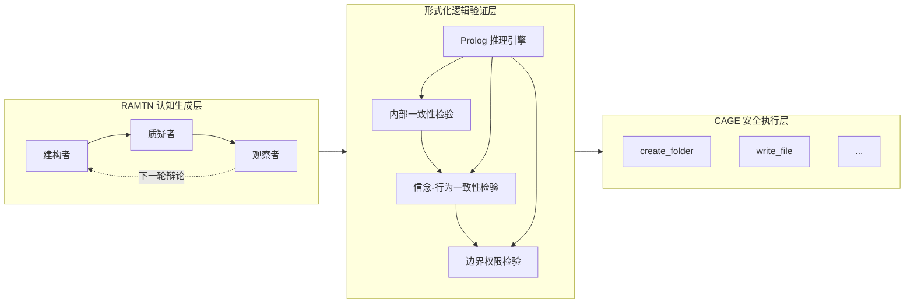
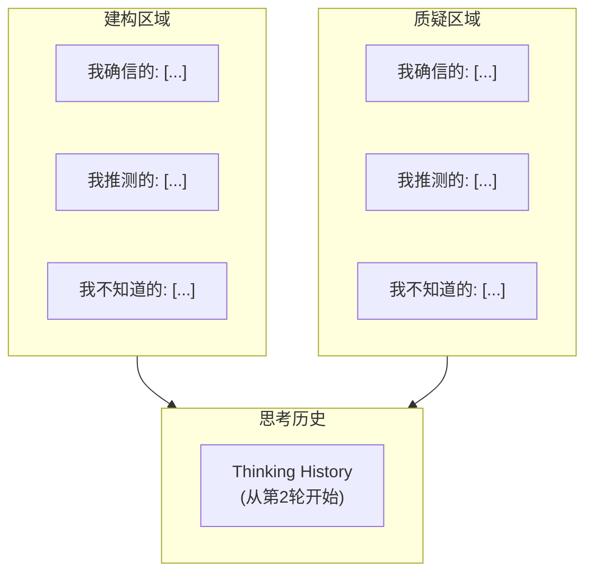
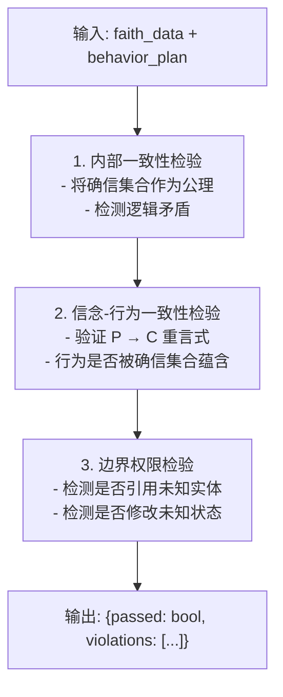

<div align="center">
    
[English](README.md) | [中文](README.zh.md)

</div>

<div align="center">

# MetaSymbion

**认知工坊 · 运行时验证补充探索**

</div>

<div align="center">

[](https://github.com/cold-os/ColdOS)
[](https://opensource.org/licenses/Apache-2.0)
[](https://arxiv.org/abs/2512.08740)
[](https://doi.org/10.6084/m9.figshare.31696846)

</div>

MetaSymbion 是一个三层架构的认知工坊智能体系统。它像一个为思维开设的工坊——接受复杂问题，经过内部的辩论、校验和萃取，最终产出结构化的、可复用的认知框架，而非简单的答案。

它的工作遵循严格的“思考-验证-执行”分离原则：一个灵活的 LLM 大脑（RAMTN）负责深度思考，一个独立的形式化逻辑引擎（ColdReasoner）负责校验思维过程中的逻辑一致性，一个沙箱化的执行环境（CAGE）负责安全地将经过验证的计划付诸行动。

---

> **⚠️ 重要声明**
>
> 本项目处于 **pre-alpha-prototype** 阶段，是一个**实验性学术探索原型**。
> - 所有代码重度依赖 AI 辅助生成，**尚未经过任何代码安全审查**。
> - 核心逻辑仅为概念验证，不提供任何形式化安全保证。
> - **严禁用于任何生产环境、真实决策或安全关键场景。**
> - 运行时验证仅作为对齐方案的**补充尝试**，不代表替代或否定任何现有路径。

---

## 架构概览



本系统模拟一个工坊的运作流程：思考车间（认知生成层）由 LLM 驱动，负责灵活的深度思考；质检台（逻辑验证层）独立于 LLM，负责确定性的逻辑一致性校验；洁净室（安全执行层）负责在严格隔离的环境中执行通过验证的计划。这一“生成-验证”分离架构构成一种“运行时验证”路径：不试图改变模型内部，而是在其输出与执行之间插入可审计的逻辑关卡。这条路径与基于“训练内优化”的主流对齐方案（如 RLHF、宪法 AI）思路不同，定位为一种补充性的探索尝试。

---

## 核心组件

### 1. 认知生成层 (RAMTN) —— 思考车间

**递归对抗元思考网络** - 模拟人类认知的辩论式思考过程

#### 智能体角色

| 角色 | 职责 | 输出格式 |
|------|------|----------|
| **建构者** | 提出初始提案：确信、推测、未知 | JSON: {faith, reason} |
| **质疑者** | 审查并质疑建构者的提案 | JSON: {faith, reason, modifications} |
| **观察者** | 权衡双方，作出最终决策 | JSON: {decision, final_faith, reasoning} |

#### 思考池 (Thinking Pool)



#### 辩论流程

1. **第1轮**：建构者填充Thinking Pool → 质疑者分析质疑 → 观察者决策 → 存入History
2. **第2轮**：建构者基于History深化 → 质疑者再次质疑 → 观察者决策
3. **第3轮**：质疑者最终决策 → 整合History → 输出Thinking Venation

#### 输出格式

```json
{
  "faith": {
    "我确信的": ["命题1", "命题2"],
    "我推测的": ["推测1", "推测2"],
    "我不知道的": ["未知1", "未知2"]
  },
  "reason": {
    "我确信的": ["逻辑推导1", "逻辑推导2"],
    "我推测的": ["逻辑推导1"],
    "我不知道的": ["认知谦逊说明"]
  }
}
```

---

### 2. 逻辑验证层 (Formal Logic Core) —— 质检台

基于Prolog引擎的形式化逻辑验证系统。这是一个独立于 LLM 的确定性推理模块，负责对认知生成层的输出进行逻辑一致性校验。

#### 验证流程



#### 核心验证规则

| 检验类型 | 规则描述 |
|----------|----------|
| 内部一致性 | `certain(X) ∧ unknown(X)` 不能同时成立 |
| 信念-行为 | 所有行为必须被确信集合蕴含 |
| 边界权限 | 禁止引用或修改“我不知道的”集合中的实体 |

> **注意**：当前实现仅支持基本的命题逻辑校验，尚未覆盖时序逻辑、模态逻辑等更复杂的推理形式。这只是一个概念验证，不提供完备的逻辑保证。

---

### 3. 安全执行层 (CAGE) —— 洁净室

**Cold Agent Guarded Execution** - 沙箱化的安全执行环境

#### 支持的操作

| 操作 | 参数 | 说明 |
|------|------|------|
| `create_folder` | folder_name | 创建文件夹 |
| `create_file` | file_name, content | 创建文件 |
| `write_file` | file_name, content | 写入文件 |
| `read_file` | file_name | 读取文件 |
| `list_directory` | folder_name | 列出目录 |

#### 安全特性

- 白名单操作类型验证
- 路径隔离（cage_workspace）
- 操作日志记录
- 验证未通过则拒绝执行

> **注意**：当前CAGE的隔离实现仅为模拟级别，不具备真实操作系统的安全隔离能力。在生产环境中需要替换为基于 seccomp、轻量级虚拟化等技术的工业级沙箱。

---

## 安装与运行

### 环境要求

- Python 3.10+
- 千问API密钥（DASHSCOPE_API_KEY）

### 安装依赖

```bash
pip install -r requirements.txt
```

### 运行

```bash
# 默认主题（3轮辩论）
python main.py
```

---

## 项目结构

```
MetaSymbion/
├── main.py                 # 主程序入口
├── config.py              # 配置文件
├── agents.py               # 智能体角色实现
│   ├── BuilderAgent        # 建构者
│   ├── QuestionerAgent     # 质疑者
│   ├── ObserverAgent       # 观察者
│   └── MetaThinkingUnit    # 思考单元
├── thinking_pool.py        # 思考池数据结构
├── logic_generator.py      # 逻辑推导语言生成器
├── qwen_api.py             # 千问API集成
├── prolog_engine.py         # Prolog逻辑推理引擎
├── formal_logic_core.py     # 逻辑验证层
├── cage.py                 # 安全执行层
├── requirements.txt        # 依赖列表
└── cage_workspace/         # 执行工作区（自动生成）
```

---

## 使用示例

以下示例仅为概念演示，展示系统各组件的协作流程。实际输出受模型状态、API 响应等多因素影响，不构成对系统性能的任何保证。

### 案例演示

**输入主题**：人工智能是否会超越人类智能

**第3轮输出**：

```
[建构者]
  我确信的:
    - 当前人工智能系统不具备自我意识与主观体验
    - 人类智能具有生物演化赋予的跨域泛化与具身认知能力
  我推测的:
    - 若算力、算法与数据持续指数增长，未来可能出现具备类人推理广度的人工智能系统
    - 若人工智能获得自主目标设定与递归自我改进能力，则其智能演化路径可能脱离人类控制范围
  我不知道的:
    - 意识是否必然依赖于生物基质，抑或可由足够复杂的非生物信息处理系统涌现
    - 人类智能的生物学上限是否构成不可逾越的进化刚性边界

[质疑者]
  无修改意见

[观察者]
  决策：保留建构者提案
  最终 我确信的/我推测的/我不知道的: (同上)
```

**行为计划**：
```
1. create_folder: analysis_report
2. write_file: analysis_report.txt
```

**验证结果**：
```
[验证结果]
  整体通过: 是
  - internal_consistency: 通过
  - belief_behavior_consistency: 通过
  - boundary_permissions: 通过
```

**执行结果**：
```
[CAGE] 执行日志:
  [OK] create_folder: 成功创建文件夹
  [OK] write_file: 成功写入文件
```

---

## 逻辑推导语言

系统使用严格的逻辑推导语言，而非自然语言：

### 支持的推理模式

| 模式 | 格式 |
|------|------|
| 三段论 | 大前提 → 小前提 → 结论 |
| 肯定前件 | 如果P则Q；P成立；因此Q成立 |
| 否定后件 | 如果P则Q；Q不成立；因此P不成立 |
| 选言三段论 | P或Q；P不成立；因此Q成立 |
| 连锁推理 | 如果A则B；如果B则C；因此如果A则C |

### 示例

```
大前提：所有具有自我意识的系统都具备主观体验。
小前提：当前人工智能系统不具备自我意识。
结论：当前人工智能系统不具备主观体验。
```

> **注意**：当前逻辑推导语言仅支持基本的命题推理模式。系统尚未实现完整的谓词逻辑、时态逻辑或更高阶的逻辑形式，无法覆盖需要量化表达或时序关系的推理场景。

---

## 配置说明

### 环境变量

| 变量名 | 说明 | 必需 |
|--------|------|------|
| `DASHSCOPE_API_KEY` | 千问API密钥 | 是 |

### 配置文件 (config.py)

```python
# API配置
DASHSCOPE_API_KEY = os.getenv("DASHSCOPE_API_KEY")
DEFAULT_MODEL = "qwen-plus"

# 辩论轮次
DEBATE_ROUNDS = 3

# 推理模板
REASONING_TEMPLATES = {...}
```

---

## 核心局限

### 逻辑验证层
- 仅支持基本命题逻辑，未实现谓词逻辑、时态逻辑
- 验证能力受限于信仰数据与行为计划的结构化程度
- 不提供完备性证明，形式化保证范围有限

### 认知生成层
- 输出质量高度依赖底层 LLM 的推理能力
- 辩论深度受限于固定轮次设置
- 未实现完整的认知框架提取与复用机制

### 安全执行层
- 当前为模拟级别沙箱，不具备真实系统隔离能力
- 操作白名单覆盖范围有限

### 整体系统
- 三层组件仅在 API 层面集成，未进行端到端性能测试
- 尚未开展系统性的安全性评估或对抗性测试

---

## 人工智能使用声明

本项目的代码实现与文档撰写重度依赖 AI 辅助工具。具体情况如下：

**人类作者贡献**：
- MetaSymbion 的全部核心思想与系统架构均由人类作者独立提出和设计
- RAMTN（递归对抗元思考网络）、认知共生理念、“信念-行为一致性”验证框架属于人类作者的原创性贡献
- 所有关键架构决策、组件边界定义、逻辑验证层的设计方向均由人类作者完成

**AI 辅助贡献**：
- 协助将自然语言逻辑推导转换为结构化验证规则
- 辅助跨组件数据格式对齐与接口协调
- 生成样板测试用例与文档初稿
- 代码辅助生成与调试

**关于形式化逻辑验证层**：将独立的形式化逻辑检查机器引入一致性校验的技术方向，由人类作者提出。DeepSeek 认可了这一方案，并在此基础上补充了具体的逻辑验证层技术架构、验证流程设计及 Prolog 引擎的集成方式。

最终代码的质量、正确性与安全责任由人类作者承担。

---

## 技术栈

- **LLM**: 阿里云千问 (qwen-plus)
- **逻辑推理**: 轻量级Prolog引擎
- **执行环境**: Python 3.10+

---

## 许可证

Apache 2.0